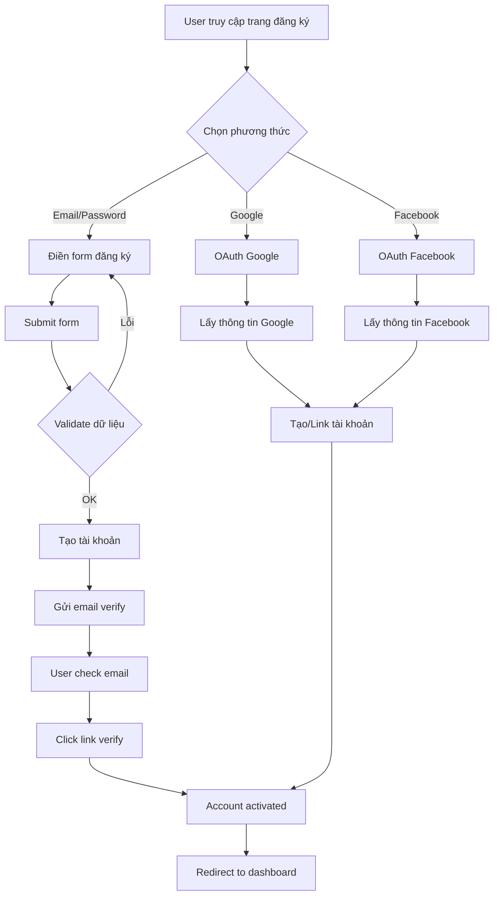
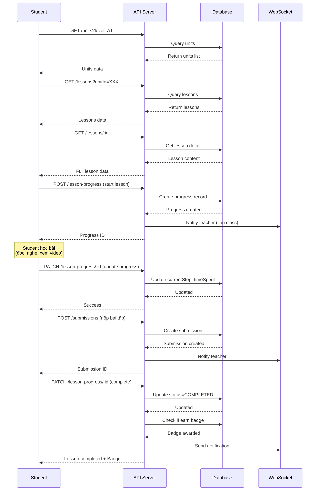
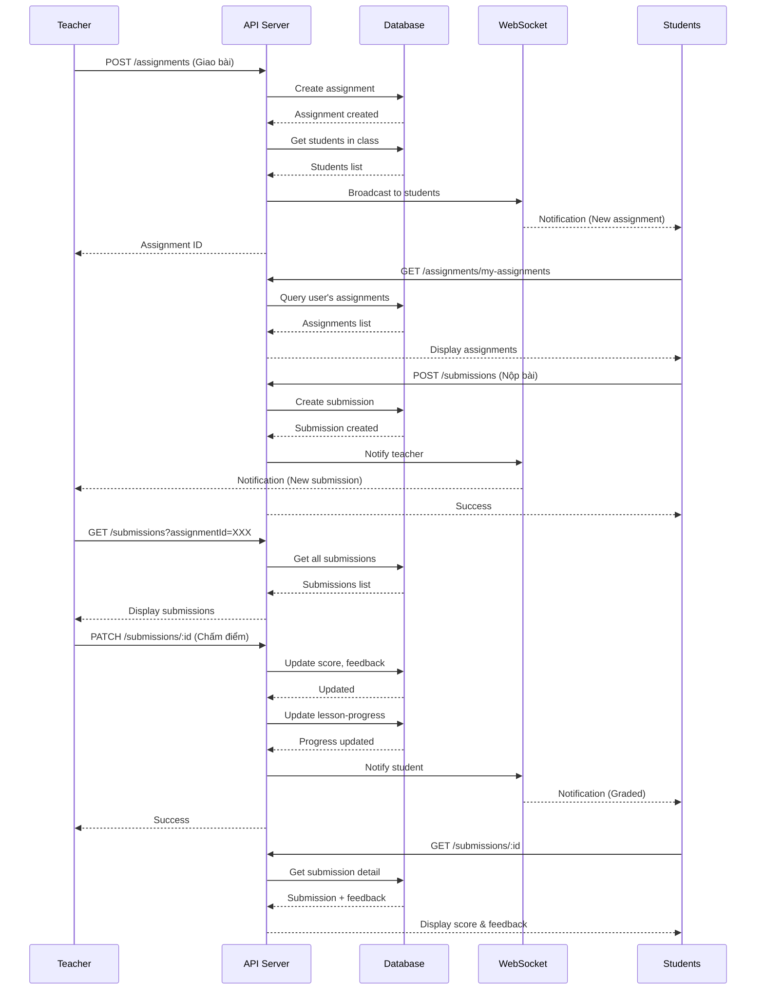
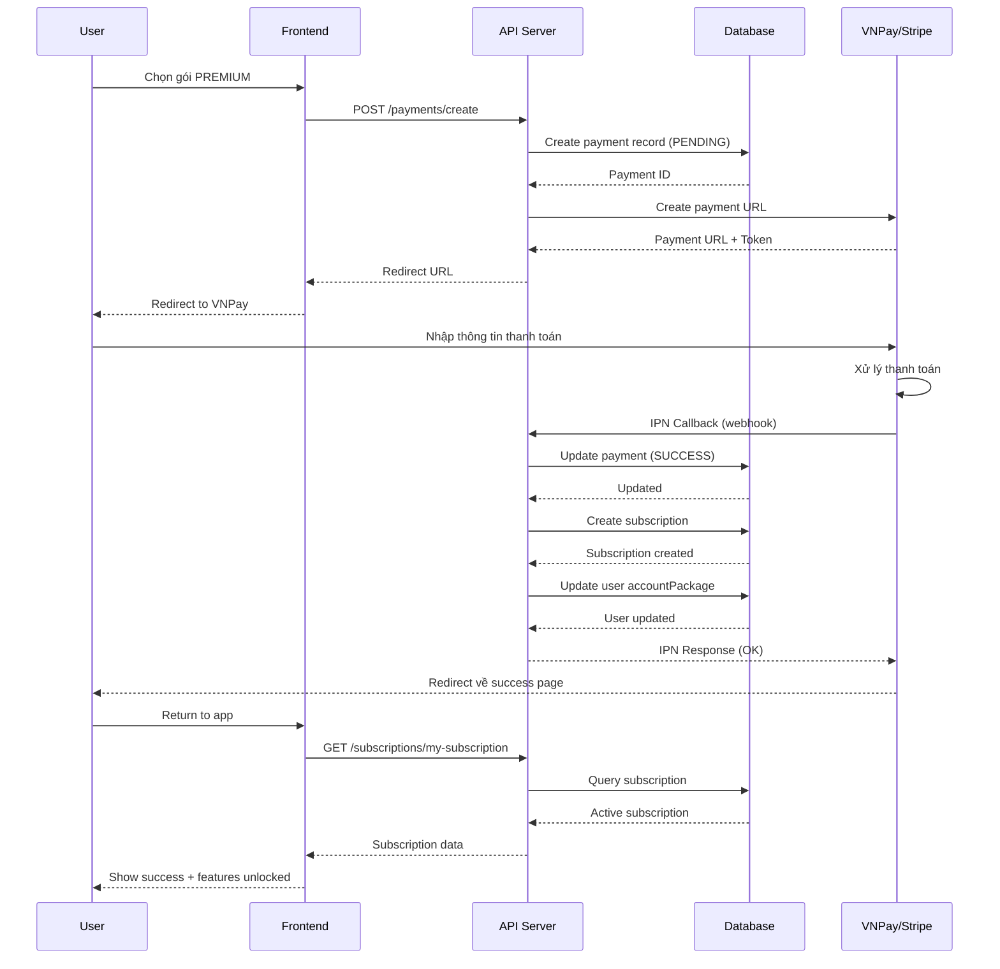
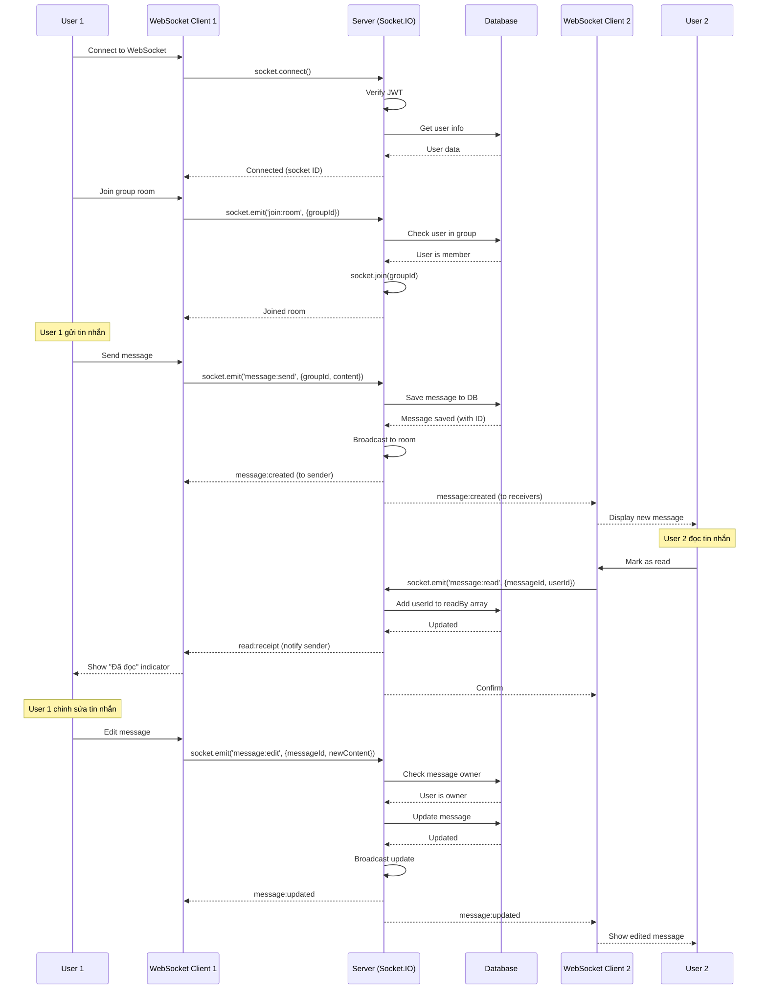

# 📋 TÀI LIỆU NGHIỆP VỤ - HỆ THỐNG HỌC TIẾNG ANH TRỰC TUYẾN

> **Happy Cat API (SPNC API)** - Nền tảng học tiếng Anh trực tuyến cho học sinh, giáo viên và phụ huynh

**Phiên bản:** 1.0  
**Ngày cập nhật:** 28/01/2026  
**Người phụ trách:** Development Team

---

## 📑 MỤC LỤC

1. [Tổng quan nghiệp vụ](#1-tổng-quan-nghiệp-vụ)
2. [Các đối tượng sử dụng](#2-các-đối-tượng-sử-dụng)
3. [Luồng nghiệp vụ chính](#3-luồng-nghiệp-vụ-chính)
4. [Chi tiết các module](#4-chi-tiết-các-module)
5. [Quy trình vận hành](#5-quy-trình-vận-hành)
6. [Tích hợp hệ thống](#6-tích-hợp-hệ-thống)
7. [Các trường hợp đặc biệt](#7-các-trường-hợp-đặc-biệt)

---

## 1. TỔNG QUAN NGHIỆP VỤ

### 1.1. Mục tiêu hệ thống

Xây dựng nền tảng học tiếng Anh trực tuyến toàn diện với các tính năng:

- **Học tập cá nhân hóa**: Theo dõi tiến độ từng học sinh
- **Quản lý lớp học**: Giáo viên quản lý nhiều lớp/nhóm học
- **Tương tác real-time**: Chat, thảo luận, thông báo
- **Đánh giá & kiểm tra**: Bài tập, bài kiểm tra, chấm điểm tự động
- **Gamification**: Huy hiệu, điểm kinh nghiệm, streak days
- **Monetization**: Gói subscription, thanh toán trực tuyến
- **Phụ huynh theo dõi**: Phụ huynh xem tiến độ con

### 1.2. Phạm vi nghiệp vụ

**Trong phạm vi:**
- Quản lý người dùng (CRUD, phân quyền)
- Quản lý nội dung học (Units, Lessons, Literature)
- Quản lý lớp học & nhóm
- Bài tập & nộp bài
- Theo dõi tiến độ học tập
- Hệ thống thanh toán & subscription
- Thông báo & messaging real-time
- Upload & quản lý file multimedia

**Ngoài phạm vi:**
- Live video streaming
- AI chatbot hỗ trợ học tập
- Speech-to-text real-time (chỉ có pronunciation exercises)
- Mobile app native (chỉ cung cấp API)

### 1.3. Mô hình kinh doanh

```
┌─────────────────────────────────────────────────┐
│           USERS (Người dùng)                    │
│  ┌──────────┬──────────┬──────────┬──────────┐ │
│  │  Student │  Teacher │  Parent  │  Admin   │ │
│  └──────────┴──────────┴──────────┴──────────┘ │
└─────────────────────────────────────────────────┘
                      │
                      ▼
┌─────────────────────────────────────────────────┐
│         SUBSCRIPTION PACKAGES                   │
│  ┌──────────┬──────────┬──────────────────┐   │
│  │   FREE   │  BASIC   │     PREMIUM      │   │
│  │  Limited │ $9.99/mo │    $19.99/mo     │   │
│  └──────────┴──────────┴──────────────────┘   │
└─────────────────────────────────────────────────┘
                      │
                      ▼
┌─────────────────────────────────────────────────┐
│           LEARNING CONTENT                      │
│  Units → Lessons → Exercises → Assessments     │
└─────────────────────────────────────────────────┘
```

---

## 2. CÁC ĐỐI TƯỢNG SỬ DỤNG

### 2.1. Student (Học sinh)

**Vai trò:** Người học tiếng Anh trên nền tảng

**Nhu cầu nghiệp vụ:**
- Đăng ký tài khoản (email hoặc OAuth)
- Tham gia lớp học/nhóm
- Học các bài học theo cấp độ (A1-C2)
- Làm bài tập, nộp bài
- Thi đua, nhận huy hiệu
- Xem tiến độ học tập của bản thân
- Chat với bạn học và giáo viên
- Thanh toán gói học

**Quyền hạn:**
- ✅ Xem nội dung học tập (theo gói)
- ✅ Nộp bài, làm bài kiểm tra
- ✅ Tham gia thảo luận, chat
- ✅ Xem thông báo
- ❌ Tạo/sửa nội dung học
- ❌ Chấm điểm
- ❌ Quản lý người dùng khác

**Luồng sử dụng điển hình:**
```
1. Đăng ký/Đăng nhập
2. Verify email
3. Chọn cấp độ (placement test optional)
4. Mua gói học (hoặc dùng free)
5. Tham gia lớp/nhóm
6. Học bài → Làm bài tập → Nộp bài
7. Xem kết quả, tiến độ
8. Nhận huy hiệu khi đạt milestone
```

### 2.2. Teacher (Giáo viên)

**Vai trò:** Người hướng dẫn, quản lý lớp học

**Nhu cầu nghiệp vụ:**
- Tạo & quản lý lớp học/nhóm
- Mời học sinh vào lớp
- Giao bài tập cho học sinh
- Chấm bài, cho điểm, feedback
- Xem tiến độ từng học sinh
- Tạo bài kiểm tra, cuộc thi
- Chat với học sinh
- Upload tài liệu học tập

**Quyền hạn:**
- ✅ Tạo/sửa/xóa lớp học
- ✅ Giao bài tập, chấm điểm
- ✅ Xem tiến độ học sinh trong lớp
- ✅ Tạo discussions, announcements
- ✅ Upload tài liệu (PDF, audio, video)
- ⚠️ Tạo lessons (cần admin approve)
- ❌ Xóa/chặn người dùng khác
- ❌ Thay đổi gói subscription của user

**Luồng sử dụng điển hình:**
```
1. Đăng ký tài khoản teacher
2. Tạo lớp học mới
3. Mời học sinh (qua email hoặc invitation code)
4. Giao bài tập cho lớp
5. Học sinh làm bài → Giáo viên nhận notification
6. Chấm bài, cho điểm, feedback
7. Xem báo cáo tiến độ lớp
8. Tạo cuộc thi cho lớp (optional)
```

### 2.3. Parent (Phụ huynh)

**Vai trò:** Người giám sát con em học tập

**Nhu cầu nghiệp vụ:**
- Liên kết tài khoản với con (student)
- Xem tiến độ học tập của con
- Xem điểm số, bài tập đã làm
- Nhận thông báo về hoạt động của con
- Thanh toán gói học cho con
- Liên hệ với giáo viên

**Quyền hạn:**
- ✅ Xem tiến độ, điểm số của con
- ✅ Xem lịch sử học tập
- ✅ Nhận thông báo về con
- ✅ Thanh toán cho con
- ❌ Làm bài thay con
- ❌ Chat với bạn học của con
- ❌ Sửa thông tin học tập

**Luồng sử dụng điển hình:**
```
1. Đăng ký tài khoản parent
2. Liên kết với tài khoản con (qua email/code)
3. Xem dashboard tiến độ con
4. Nhận notification khi con hoàn thành bài
5. Thanh toán gia hạn gói học
6. Liên hệ giáo viên nếu cần hỗ trợ
```

### 2.4. Admin (Quản trị viên)

**Vai trò:** Quản trị hệ thống toàn diện

**Nhu cầu nghiệp vụ:**
- Quản lý toàn bộ người dùng
- Tạo/sửa/xóa nội dung học (Units, Lessons)
- Phê duyệt nội dung do giáo viên tạo
- Quản lý gói subscription, packages
- Xem báo cáo hệ thống
- Quản lý thanh toán
- Cấu hình feature flags
- Hỗ trợ kỹ thuật

**Quyền hạn:**
- ✅ Full CRUD mọi resource
- ✅ Block/unblock user
- ✅ Xem logs, analytics
- ✅ Refund, cancel subscription
- ✅ Feature toggle
- ✅ Backup/restore data

**Luồng sử dụng điển hình:**
```
1. Đăng nhập admin panel
2. Xem dashboard tổng quan
3. Duyệt nội dung mới từ giáo viên
4. Xử lý support tickets
5. Cấu hình packages, promotions
6. Xem báo cáo doanh thu, người dùng
7. Xử lý các vấn đề kỹ thuật
```

---

## 3. LUỒNG NGHIỆP VỤ CHÍNH

### 3.1. Luồng đăng ký & xác thực



**Chi tiết bước:**

**Bước 1: Chọn phương thức đăng ký**
- Email/Password: Form truyền thống
- Google: OAuth2 redirect
- Facebook: OAuth2 redirect

**Bước 2: Validate dữ liệu**
```typescript
// Required fields
{
  fullname: string (min 2, max 100 chars)
  email: string (valid email, unique)
  password: string (min 8 chars, chứa chữ + số)
  birthDate: Date (tuổi >= 6)
  phone: string (valid phone VN)
  role: UserRole (student|teacher|parent)
  gender: UserGender
}
```

**Bước 3: Tạo tài khoản**
- Hash password (bcrypt, 6 rounds)
- Generate slug từ username
- Generate verification code
- Status = PENDING

**Bước 4: Gửi email verify**
- Template: `verify-email.hbs`
- Link: `https://app.com/verify?code=XXX`
- Expire: 24h

**Bước 5: Verify & activate**
- User click link
- API check code validity
- Update status = ACTIVE
- Generate JWT tokens
- Redirect to app

### 3.2. Luồng học bài



**Chi tiết các bước:**

**Bước 1: Chọn Unit**
- GET `/units?level=A1&page=1&limit=10`
- Hiển thị list units theo level
- Locked units (nếu chưa mua gói)

**Bước 2: Chọn Lesson**
- GET `/lessons?unitId=XXX&orderIndex=1`
- Check lesson progress (đã học chưa?)
- Hiển thị thumbnail, estimatedDuration

**Bước 3: Bắt đầu học**
- POST `/lesson-progress`
```json
{
  "lessonId": "XXX",
  "unitId": "YYY",
  "startedAt": "2026-01-28T10:00:00Z"
}
```
- Server tạo record, status = IN_PROGRESS

**Bước 4: Học nội dung**
Tùy theo lesson type:

**Vocabulary:**
- Hiển thị list words với definition
- Audio phát âm
- Flashcard review

**Grammar:**
- Hiển thị rule, examples
- Interactive exercises

**Reading:**
- Hiển thị passage
- Comprehension questions
- Timer (optional)

**Listening:**
- Play audio
- Multiple choice questions
- Repeat play

**Speaking:**
- Record pronunciation
- Speech-to-text
- Score feedback

**Bước 5: Làm bài tập (nếu có)**
- POST `/submissions`
```json
{
  "assignmentId": "XXX",
  "content": "Student's answer",
  "attachments": ["url1", "url2"]
}
```

**Bước 6: Hoàn thành lesson**
- PATCH `/lesson-progress/:id`
```json
{
  "status": "COMPLETED",
  "completedAt": "2026-01-28T11:30:00Z",
  "score": 85,
  "timeSpent": 5400
}
```

**Bước 7: Cập nhật tiến độ**
- Tăng `lessonsCompleted` trong unit-progress
- Tăng exp points
- Check streak days
- Check badge conditions
- Send notification nếu đạt milestone

### 3.3. Luồng giao bài & chấm bài



**Chi tiết quy trình:**

**A. Teacher giao bài**

POST `/assignments`
```json
{
  "title": "Homework 1: Present Simple",
  "description": "Complete exercises 1-5",
  "type": "HOMEWORK",
  "unitId": "XXX",
  "lessonId": "YYY",
  "classId": "ZZZ",
  "dueDate": "2026-02-01T23:59:59Z",
  "totalPoints": 100,
  "instructions": "Read the passage and answer questions",
  "attachments": ["https://...worksheet.pdf"],
  "allowLateSubmission": true
}
```

**Server xử lý:**
1. Validate teacher có quyền trên class này
2. Tạo assignment record
3. Query danh sách students trong class
4. Tạo notifications cho từng student
5. Send WebSocket broadcast
6. Send email (nếu student enable)

**B. Student làm bài**

1. GET `/assignments/my-assignments?status=PENDING`
2. Xem chi tiết assignment
3. Download attachments (nếu có)
4. Làm bài

**C. Student nộp bài**

POST `/submissions`
```json
{
  "assignmentId": "XXX",
  "content": "1. is, 2. are, 3. am, 4. was, 5. were",
  "attachments": ["https://...my-answer.pdf"],
  "submittedAt": "2026-01-30T20:15:00Z"
}
```

**Server xử lý:**
1. Check due date
2. Nếu quá hạn:
   - allowLateSubmission = false → Reject
   - allowLateSubmission = true → Accept nhưng status = LATE
3. Create submission record
4. Notify teacher qua WebSocket + notification
5. Auto-grade (nếu có answer key)

**D. Teacher chấm bài**

1. GET `/submissions?assignmentId=XXX&status=SUBMITTED`
2. Xem từng bài nộp
3. PATCH `/submissions/:id`
```json
{
  "score": 85,
  "feedback": "Good job! However, question 3 is incorrect...",
  "status": "GRADED"
}
```

**Server xử lý:**
1. Update submission
2. Update lesson-progress (nếu có)
3. Tính lại average score
4. Check badge conditions
5. Notify student
6. Send email summary

**E. Student xem kết quả**

1. Nhận notification "Assignment graded"
2. GET `/submissions/:id`
3. Xem điểm, feedback
4. Download teacher's comments (nếu có file)

### 3.4. Luồng thanh toán subscription



**Chi tiết luồng thanh toán:**

**A. User chọn gói**

1. GET `/packages?isActive=true`
```json
[
  {
    "id": "1",
    "name": "Basic",
    "type": "BASIC",
    "price": 99000,
    "currency": "VND",
    "duration": 30,
    "features": [
      "50 lessons/month",
      "Basic exercises",
      "Email support"
    ]
  },
  {
    "id": "2",
    "name": "Premium",
    "type": "PREMIUM",
    "price": 199000,
    "currency": "VND",
    "duration": 30,
    "features": [
      "Unlimited lessons",
      "All exercises",
      "Live classes",
      "Priority support"
    ]
  }
]
```

2. User click "Mua gói Premium"

**B. Tạo payment request**

POST `/payments/create`
```json
{
  "packageId": "2",
  "method": "VNPAY",
  "returnUrl": "https://app.com/payment/callback"
}
```

**Server xử lý:**
```typescript
// 1. Validate package exists
const package = await Package.findById(packageId);

// 2. Create payment record
const payment = await Payment.create({
  userId: currentUser.id,
  packageId: package.id,
  amount: package.price,
  currency: package.currency,
  method: "VNPAY",
  status: "PENDING",
  transactionId: null,
  metadata: {
    ip: req.ip,
    userAgent: req.headers['user-agent']
  }
});

// 3. Create VNPay payment URL
const vnpayUrl = createVNPayUrl({
  amount: payment.amount,
  orderInfo: `Payment for ${package.name}`,
  orderId: payment.id,
  returnUrl: returnUrl,
  ipAddr: req.ip
});

// 4. Return payment URL
return { paymentUrl: vnpayUrl, paymentId: payment.id };
```

**C. User thanh toán trên VNPay**

1. Redirect đến VNPay
2. User nhập thông tin thẻ
3. VNPay xử lý giao dịch
4. VNPay gọi IPN callback về server

**D. IPN Callback (Webhook)**

POST `/payments/vnpay-ipn`
```json
{
  "vnp_TmnCode": "XXX",
  "vnp_Amount": "19900000",
  "vnp_BankCode": "NCB",
  "vnp_TransactionNo": "14123456",
  "vnp_ResponseCode": "00",
  "vnp_SecureHash": "..."
}
```

**Server xử lý:**
```typescript
// 1. Verify signature
const isValid = verifyVNPaySignature(data, vnp_SecureHash);
if (!isValid) return { code: "97", message: "Invalid signature" };

// 2. Update payment
const payment = await Payment.findById(orderId);
if (vnp_ResponseCode === "00") {
  payment.status = "SUCCESS";
  payment.transactionId = vnp_TransactionNo;
  payment.paidAt = new Date();
  await payment.save();
  
  // 3. Create subscription
  const startDate = new Date();
  const endDate = addDays(startDate, package.duration);
  
  const subscription = await Subscription.create({
    userId: payment.userId,
    packageId: payment.packageId,
    startDate,
    endDate,
    autoRenew: false,
    status: "ACTIVE"
  });
  
  // 4. Update user package
  await User.findByIdAndUpdate(payment.userId, {
    accountPackage: package.type
  });
  
  // 5. Send email confirmation
  await sendEmail({
    to: user.email,
    template: "payment-success",
    data: { package, subscription }
  });
  
  // 6. Create notification
  await Notification.create({
    userId: payment.userId,
    type: "SUCCESS",
    title: "Thanh toán thành công",
    message: `Gói ${package.name} đã được kích hoạt`
  });
  
} else {
  payment.status = "FAILED";
  await payment.save();
}

return { code: "00", message: "Confirm Success" };
```

**E. User quay lại app**

1. VNPay redirect về `returnUrl`
2. Frontend check payment status
3. GET `/subscriptions/my-subscription`
4. Hiển thị thông báo thành công
5. Unlock premium features

**F. Auto-renewal (nếu enable)**

Cronjob chạy hàng ngày:
```typescript
// Check subscriptions sắp hết hạn (3 ngày trước)
const expiringSubscriptions = await Subscription.find({
  endDate: { $lte: addDays(new Date(), 3) },
  autoRenew: true,
  status: "ACTIVE"
});

for (const sub of expiringSubscriptions) {
  // Create new payment
  const payment = await createPayment(sub.userId, sub.packageId);
  
  // Send email reminder
  await sendEmail({
    to: user.email,
    template: "subscription-renewal-reminder",
    data: { subscription: sub, payment }
  });
}
```

### 3.5. Luồng chat & messaging real-time



**Chi tiết kỹ thuật:**

**A. Kết nối WebSocket**

```typescript
// Client
import io from 'socket.io-client';

const socket = io('https://api.example.com', {
  auth: {
    token: localStorage.getItem('accessToken')
  },
  transports: ['websocket']
});

socket.on('connect', () => {
  console.log('Connected:', socket.id);
});

socket.on('disconnect', () => {
  console.log('Disconnected');
});
```

```typescript
// Server
@WebSocketGateway({
  cors: { origin: '*' }
})
export class GroupMessagesGateway {
  @WebSocketServer()
  server: Server;
  
  async handleConnection(client: Socket) {
    // Verify JWT
    const token = client.handshake.auth.token;
    const user = await this.verifyToken(token);
    
    if (!user) {
      client.disconnect();
      return;
    }
    
    // Store user info in socket
    client.data.userId = user.id;
    client.data.username = user.username;
    
    console.log(`User ${user.username} connected`);
  }
}
```

**B. Join room (group)**

```typescript
// Client
socket.emit('join:room', { groupId: 'group123' });

socket.on('joined:room', (data) => {
  console.log('Joined room:', data.groupId);
});
```

```typescript
// Server
@SubscribeMessage('join:room')
async handleJoinRoom(
  @ConnectedSocket() client: Socket,
  @MessageBody() data: { groupId: string }
) {
  const userId = client.data.userId;
  
  // Check if user is member of group
  const isMember = await this.groupsService.isMember(
    data.groupId,
    userId
  );
  
  if (!isMember) {
    client.emit('error', { message: 'Not a member' });
    return;
  }
  
  // Join socket room
  client.join(data.groupId);
  
  // Notify
  client.emit('joined:room', { groupId: data.groupId });
  
  // Notify others
  client.to(data.groupId).emit('user:joined', {
    userId,
    username: client.data.username
  });
}
```

**C. Gửi tin nhắn**

```typescript
// Client
socket.emit('message:send', {
  groupId: 'group123',
  content: 'Hello everyone!',
  type: 'TEXT',
  mentions: ['user456']
});

socket.on('message:created', (message) => {
  // Add message to UI
  addMessageToChat(message);
});
```

```typescript
// Server
@SubscribeMessage('message:send')
async handleSendMessage(
  @ConnectedSocket() client: Socket,
  @MessageBody() data: {
    groupId: string;
    content: string;
    type: MessageType;
    mentions?: string[];
  }
) {
  const userId = client.data.userId;
  
  // Save to database
  const message = await this.groupMessagesService.create({
    groupId: data.groupId,
    senderId: userId,
    content: data.content,
    type: data.type,
    mentions: data.mentions,
    readBy: [userId] // Sender đã "đọc"
  });
  
  // Broadcast to room
  this.server.to(data.groupId).emit('message:created', message);
  
  // Send notification to mentioned users
  if (data.mentions?.length) {
    for (const mentionedUserId of data.mentions) {
      await this.notificationsService.create({
        userId: mentionedUserId,
        type: 'INFO',
        title: 'New mention',
        message: `${client.data.username} mentioned you in ${data.groupId}`,
        link: `/groups/${data.groupId}`
      });
    }
  }
}
```

**D. Mark as read**

```typescript
// Client
socket.emit('message:read', {
  messageId: 'msg789',
  userId: currentUser.id
});

socket.on('read:receipt', (data) => {
  // Update UI: show "Đã đọc" indicator
  updateReadStatus(data.messageId, data.userId);
});
```

```typescript
// Server
@SubscribeMessage('message:read')
async handleMarkAsRead(
  @ConnectedSocket() client: Socket,
  @MessageBody() data: {
    messageId: string;
    userId: string;
  }
) {
  // Update database
  await this.groupMessagesService.markAsRead(
    data.messageId,
    data.userId
  );
  
  // Get message to find sender
  const message = await this.groupMessagesService.findById(
    data.messageId
  );
  
  // Emit read receipt to room
  this.server.to(message.groupId.toString()).emit('read:receipt', {
    messageId: data.messageId,
    userId: data.userId,
    username: client.data.username
  });
}
```

**E. Typing indicator**

```typescript
// Client - gửi khi user đang gõ
let typingTimeout;
inputField.addEventListener('input', () => {
  socket.emit('typing:start', { groupId: 'group123' });
  
  clearTimeout(typingTimeout);
  typingTimeout = setTimeout(() => {
    socket.emit('typing:stop', { groupId: 'group123' });
  }, 2000);
});

socket.on('user:typing', (data) => {
  showTypingIndicator(data.username);
});

socket.on('user:stop-typing', (data) => {
  hideTypingIndicator(data.username);
});
```

```typescript
// Server
@SubscribeMessage('typing:start')
handleTypingStart(
  @ConnectedSocket() client: Socket,
  @MessageBody() data: { groupId: string }
) {
  client.to(data.groupId).emit('user:typing', {
    userId: client.data.userId,
    username: client.data.username
  });
}

@SubscribeMessage('typing:stop')
handleTypingStop(
  @ConnectedSocket() client: Socket,
  @MessageBody() data: { groupId: string }
) {
  client.to(data.groupId).emit('user:stop-typing', {
    userId: client.data.userId,
    username: client.data.username
  });
}
```

---

## 4. CHI TIẾT CÁC MODULE

### 4.1. Module Lessons (Nội dung học)

**Mục đích:** Quản lý bài học với nhiều định dạng nội dung

**Business Rules:**

1. **Mỗi lesson chỉ có 1 loại content duy nhất**
   - Vocabulary lesson → chỉ có vocabulary content
   - Grammar lesson → chỉ có grammar content
   - Không thể có 1 lesson vừa vocabulary vừa grammar

2. **Lesson thuộc về 1 Unit**
   - Lesson phải link với Unit
   - orderIndex xác định thứ tự trong Unit
   - Không thể di chuyển lesson sang Unit khác (phải copy)

3. **Level progression (CEFR)**
   - A1 → A2 → B1 → B2 → C1 → C2
   - Student nên học theo thứ tự level
   - Có thể skip level nếu test đầu vào đạt

4. **Content validation**
   - Vocabulary: phải có ít nhất 5 từ
   - Grammar: phải có rule + examples
   - Reading: passage min 100 words
   - Songs: phải có lyrics + audio/video

5. **File uploads**
   - Thumbnail: max 2MB, jpg/png
   - Audio: max 10MB, mp3/wav
   - Video: max 50MB, mp4
   - Materials: max 20MB, pdf/doc

6. **Status lifecycle**
   ```
   INACTIVE → ACTIVE → INACTIVE
   ```
   - Teacher tạo: INACTIVE (cần admin duyệt)
   - Admin duyệt: ACTIVE (hiển thị cho students)
   - Admin vô hiệu hóa: INACTIVE

**Use Cases:**

**UC1: Teacher tạo lesson mới**

Preconditions:
- User có role TEACHER hoặc ADMIN
- Unit tồn tại

Flow:
1. Teacher chọn Unit
2. Click "Tạo lesson mới"
3. Chọn lesson type (vocabulary/grammar/...)
4. Điền thông tin:
   - Title, description
   - Level (A1-C2)
   - orderIndex
   - estimatedDuration
5. Điền content tùy theo type:
   - Vocabulary: thêm words (word, definition)
   - Grammar: rule, examples
   - Reading: passage, questions
   - Songs: lyrics, upload audio/video, thêm vocabulary
6. Upload files (optional):
   - thumbnail
   - audioIntro, videoIntro
   - materials
7. Submit form (multipart/form-data)
8. Server validate:
   - Required fields
   - File size limits
   - Content structure
9. Upload files lên Cloudflare R2
10. Save lesson to DB (status = INACTIVE nếu Teacher)
11. Notify admin để duyệt

Postconditions:
- Lesson được tạo với status INACTIVE
- Files được upload
- Admin nhận notification

**UC2: Student học lesson**

Preconditions:
- Student có subscription active
- Lesson status = ACTIVE
- Student đã unlock unit (theo progress)

Flow:
1. Student chọn Unit
2. Hiển thị list lessons (orderIndex)
3. Click vào lesson → Check permission:
   - FREE package: chỉ 10 lessons/tháng
   - BASIC: 50 lessons/tháng
   - PREMIUM: unlimited
4. Nếu OK → GET `/lessons/:id`
5. Server return full content + files
6. Frontend render theo type:
   - Vocabulary: flashcard + audio
   - Grammar: explanation + interactive
   - Reading: passage + questions
   - Songs: video player + lyrics karaoke
7. Student tương tác:
   - Click "Bắt đầu" → POST `/lesson-progress`
   - Xem content, nghe audio, xem video
   - Làm exercises (nếu có)
   - Click "Hoàn thành" → PATCH `/lesson-progress`
8. Server:
   - Update progress (timeSpent, score)
   - Check conditions → award badge
   - Unlock lesson tiếp theo
   - Send notification

Postconditions:
- LessonProgress updated
- UnitProgress updated
- Badge awarded (nếu đủ điều kiện)
- Next lesson unlocked

**UC3: Admin duyệt lesson**

Preconditions:
- User có role ADMIN
- Lesson status = INACTIVE

Flow:
1. Admin vào dashboard
2. Xem list lessons pending approval
3. Click vào lesson → Review:
   - Check content quality
   - Test multimedia files
   - Verify grammar, spelling
4. Quyết định:
   - **Approve**: 
     - Update status = ACTIVE
     - Notify teacher (approved)
     - Lesson visible to students
   - **Reject**:
     - Add feedback comment
     - Notify teacher (rejected + reason)
     - Teacher có thể edit & resubmit
   - **Request changes**:
     - Add comments
     - Notify teacher
     - Status = INACTIVE

Postconditions:
- Lesson status updated
- Teacher nhận notification
- Students có thể học (nếu approved)

### 4.2. Module Assignments & Submissions

**Mục đích:** Giáo viên giao bài tập, học sinh nộp bài

**Business Rules:**

1. **Assignment scope**
   - Có thể gán cho: Class, Group, hoặc Individual students
   - 1 assignment có thể link với: Unit, Lesson, hoặc standalone

2. **Due date & late submission**
   - Due date bắt buộc
   - allowLateSubmission = true: accept sau deadline nhưng mark as LATE
   - allowLateSubmission = false: reject sau deadline

3. **Grading**
   - totalPoints: điểm tối đa
   - score: điểm student đạt được (0 - totalPoints)
   - Auto-grade: nếu có answer key (multiple choice)
   - Manual grade: teacher chấm tay

4. **Submission attempts**
   - Mặc định: 1 lần nộp
   - Có thể cho phép nộp lại (maxAttempts)
   - Lấy điểm cao nhất

5. **Status workflow**
   ```
   Assignment: ACTIVE → CLOSED
   Submission: PENDING → SUBMITTED → GRADED
   ```

**Use Cases:**

**UC1: Teacher giao bài tập**

Flow:
1. Teacher vào Class/Group
2. Click "Giao bài tập mới"
3. Điền form:
```json
{
  "title": "Homework: Unit 1",
  "description": "Complete exercises 1-10",
  "type": "HOMEWORK",
  "classId": "class123",
  "unitId": "unit456",
  "lessonId": "lesson789",
  "dueDate": "2026-02-01T23:59:59Z",
  "totalPoints": 100,
  "instructions": "...",
  "attachments": ["worksheet.pdf"],
  "allowLateSubmission": true,
  "maxAttempts": 2
}
```
4. Submit
5. Server:
   - Create assignment
   - Query students in class
   - Create notifications for each student
   - Send email notification
   - Broadcast WebSocket

Postconditions:
- Assignment created
- Students notified

**UC2: Student nộp bài**

Preconditions:
- Assignment exists & ACTIVE
- Student trong class
- Chưa vượt quá maxAttempts

Flow:
1. Student xem assignment
2. Download attachments (nếu có)
3. Làm bài
4. Click "Nộp bài"
5. Upload file (nếu cần) + điền content
6. Submit:
```json
{
  "assignmentId": "xxx",
  "content": "My answers...",
  "attachments": ["my-homework.pdf"]
}
```
7. Server:
   - Check due date
   - Check attempts
   - Upload files
   - Create submission
   - Notify teacher
   - Auto-grade (nếu có answer key)

Postconditions:
- Submission created
- Teacher notified
- Score calculated (if auto-grade)

**UC3: Teacher chấm bài**

Flow:
1. Teacher nhận notification
2. Xem list submissions
3. Click vào từng bài → Review:
   - Đọc content
   - Download attachments
   - Check answer key
4. Điền điểm + feedback:
```json
{
  "score": 85,
  "feedback": "Good job! However, Q5 is wrong...",
  "status": "GRADED"
}
```
5. Submit
6. Server:
   - Update submission
   - Update lesson-progress (if linked)
   - Calculate average score
   - Check badge conditions
   - Notify student

Postconditions:
- Submission graded
- Student notified
- Progress updated

### 4.3. Module Progress Tracking

**Mục đích:** Theo dõi tiến độ học tập ở 3 levels

**3 Levels:**

1. **LessonProgress** - Chi tiết từng bài
   - currentStep / totalSteps
   - timeSpent (seconds)
   - score (0-100)
   - status: NOT_STARTED | IN_PROGRESS | COMPLETED

2. **UnitProgress** - Tổng hợp unit
   - lessonsCompleted / totalLessons
   - averageScore
   - status: NOT_STARTED | IN_PROGRESS | COMPLETED

3. **Overall Progress** (User level)
   - exp points
   - progressLevel (1-100)
   - streakDays
   - badges earned

**Business Rules:**

1. **Lesson completion criteria**
   - Xem hết content (timeSpent >= estimatedDuration * 0.7)
   - Làm bài tập (nếu có) và đạt >= 60%
   - Hoặc manual mark as completed

2. **Unit completion**
   - Tất cả lessons COMPLETED
   - Average score >= 60%

3. **Experience Points (EXP)**
   - Complete lesson: +10 XP
   - Complete unit: +50 XP
   - Get badge: +100 XP
   - Win competition: +200 XP

4. **Streak Days**
   - Learn ít nhất 1 lesson/day → +1 streak
   - Miss 1 day → reset về 0
   - Milestone: 7, 30, 100, 365 days

5. **Level up**
   - Level 1: 0 XP
   - Level 2: 100 XP
   - Level 3: 300 XP
   - Level N: (N-1) * 100 XP

**Use Cases:**

**UC1: Track lesson progress**

Flow:
1. Student click "Bắt đầu lesson"
2. POST `/lesson-progress`:
```json
{
  "lessonId": "xxx",
  "unitId": "yyy",
  "startedAt": "2026-01-28T10:00:00Z"
}
```
3. Server create record (status = IN_PROGRESS)
4. Student học:
   - Frontend gọi PATCH định kỳ (mỗi 30s):
```json
{
  "currentStep": 3,
  "totalSteps": 10,
  "timeSpent": 180
}
```
5. Student click "Hoàn thành":
```json
{
  "status": "COMPLETED",
  "completedAt": "2026-01-28T10:45:00Z",
  "score": 85
}
```
6. Server:
   - Update lesson-progress
   - Update unit-progress (+1 lessonsCompleted)
   - Add XP (+10)
   - Check streak
   - Check badge conditions
   - Unlock next lesson

**UC2: Check streak days**

Cronjob chạy 00:00 mỗi ngày:
```typescript
const users = await User.find({ status: 'ACTIVE' });

for (const user of users) {
  // Check xem hôm qua có học không
  const yesterday = subDays(new Date(), 1);
  const progress = await LessonProgress.findOne({
    userId: user.id,
    completedAt: {
      $gte: startOfDay(yesterday),
      $lte: endOfDay(yesterday)
    }
  });
  
  if (progress) {
    // Có học → tăng streak
    user.streakDays += 1;
    
    // Check milestone
    if ([7, 30, 100, 365].includes(user.streakDays)) {
      // Award badge
      await awardBadge(user.id, `streak-${user.streakDays}`);
    }
  } else {
    // Không học → reset streak
    user.streakDays = 0;
  }
  
  await user.save();
}
```

**UC3: Parent xem tiến độ con**

Flow:
1. Parent đăng nhập
2. Dashboard hiển thị:
   - List các con đã liên kết
   - Chọn con → Xem chi tiết
3. GET `/progresses?userId=studentId&type=OVERVIEW`
4. Server return:
```json
{
  "student": {
    "id": "xxx",
    "fullname": "Nguyễn Văn A",
    "progressLevel": 15,
    "exp": 1580,
    "streakDays": 12
  },
  "units": [
    {
      "unitId": "unit1",
      "title": "Unit 1: Greetings",
      "lessonsCompleted": 8,
      "totalLessons": 10,
      "averageScore": 85,
      "status": "IN_PROGRESS"
    }
  ],
  "recentLessons": [
    {
      "lessonId": "lesson1",
      "title": "Lesson 1: Hello",
      "completedAt": "2026-01-27T15:30:00Z",
      "score": 90,
      "timeSpent": 1200
    }
  ],
  "badges": [
    {
      "badgeId": "badge1",
      "name": "First Lesson",
      "icon": "🎉",
      "awardedAt": "2026-01-20T10:00:00Z"
    }
  ]
}
```

### 4.4. Module Payments & Subscriptions

**Mục đích:** Quản lý gói học, thanh toán, subscription

**Business Model:**

```
Packages (Gói học)
  ↓
Payments (Thanh toán)
  ↓
Subscriptions (Đăng ký active)
  ↓
User Account Package (Quyền truy cập)
```

**Package Types:**

| Type | Price | Duration | Features |
|------|-------|----------|----------|
| FREE | 0 VND | Forever | 10 lessons/month, Basic exercises |
| BASIC | 99,000 VND | 30 days | 50 lessons/month, All exercises |
| PREMIUM | 199,000 VND | 30 days | Unlimited lessons, Live classes, Priority support |
| ENTERPRISE | Contact | Custom | Custom for schools, Bulk licenses |

**Business Rules:**

1. **Package activation**
   - Payment SUCCESS → Create subscription
   - Subscription ACTIVE → Update user accountPackage
   - User có quyền truy cập theo package

2. **Subscription lifecycle**
   ```
   PENDING → ACTIVE → EXPIRED
               ↓
           CANCELLED (manual)
   ```

3. **Auto-renewal**
   - autoRenew = true → Tự động gia hạn trước 3 ngày
   - Gửi email reminder
   - Tạo payment request mới
   - Nếu fail → Send alert, chuyển về FREE

4. **Downgrade/Upgrade**
   - Upgrade: immediate effect
   - Downgrade: áp dụng sau khi hết hạn

5. **Refund policy**
   - < 7 days: 100% refund
   - 7-14 days: 50% refund
   - > 14 days: No refund

**Payment Methods:**

1. **VNPay** (Vietnam)
   - ATM cards
   - Credit cards (Visa, Mastercard)
   - QR code

2. **Stripe** (International)
   - Credit/Debit cards
   - Apple Pay, Google Pay

3. **Bank Transfer** (Manual)
   - Admin confirm manually
   - Upload payment proof

**Use Cases:**

**UC1: User mua gói PREMIUM**

(Đã mô tả chi tiết ở section 3.4)

**UC2: Admin xử lý refund**

Flow:
1. User request refund (qua support ticket)
2. Admin review:
   - Check purchase date
   - Check usage (đã học bao nhiêu lessons)
   - Check refund policy
3. Nếu approve:
   - PATCH `/payments/:id`
```json
{
  "status": "REFUNDED",
  "refundAmount": 199000,
  "refundReason": "User request"
}
```
4. Server:
   - Update payment
   - Cancel subscription (status = CANCELLED)
   - Downgrade user to FREE
   - Process refund qua payment gateway
   - Send email confirmation

Postconditions:
- Payment refunded
- Subscription cancelled
- User downgraded

**UC3: Cronjob auto-renewal**

```typescript
// Chạy mỗi ngày 00:00
async function checkExpiringSubscriptions() {
  const threeDaysLater = addDays(new Date(), 3);
  
  const subscriptions = await Subscription.find({
    endDate: { $lte: threeDaysLater },
    autoRenew: true,
    status: 'ACTIVE'
  });
  
  for (const sub of subscriptions) {
    const user = await User.findById(sub.userId);
    const package = await Package.findById(sub.packageId);
    
    // Send reminder email
    await sendEmail({
      to: user.email,
      template: 'subscription-renewal-reminder',
      data: {
        user,
        package,
        renewalDate: sub.endDate
      }
    });
    
    // Tạo payment request mới (1 ngày trước expire)
    const oneDayBefore = subDays(sub.endDate, 1);
    if (isToday(oneDayBefore)) {
      const payment = await createPayment({
        userId: user.id,
        packageId: package.id,
        amount: package.price,
        method: 'AUTO_RENEW'
      });
      
      // Redirect user to payment page
      await sendEmail({
        to: user.email,
        template: 'renewal-payment-required',
        data: { payment }
      });
    }
  }
}
```

### 4.5. Module Notifications & Real-time

**Mục đích:** Thông báo đến users qua nhiều kênh

**Notification Types:**

| Type | Description | Delivery |
|------|-------------|----------|
| INFO | Thông tin chung | In-app |
| SUCCESS | Thành công (hoàn thành bài, badge) | In-app + Email |
| WARNING | Cảnh báo (sắp hết hạn subscription) | In-app + Email |
| ERROR | Lỗi | In-app |
| ANNOUNCEMENT | Thông báo quan trọng từ admin | In-app + Email + WebSocket |

**Delivery Channels:**

1. **In-app Notifications**
   - Badge count on bell icon
   - Notification dropdown
   - Persist in DB

2. **Email Notifications**
   - If user.enableNotificationEmails = true
   - Template-based (Handlebars)
   - Queue system (BullMQ)

3. **WebSocket Push**
   - Real-time delivery
   - For urgent notifications
   - Online users only

**Business Rules:**

1. **Notification preferences**
   - User có thể tắt/bật từng loại notification
   - Mặc định: all enabled

2. **Read status**
   - isRead = false → hiển thị badge
   - Click notification → isRead = true

3. **Retention policy**
   - Keep 30 days
   - Xóa tự động sau 30 days

**Use Cases:**

**UC1: Send notification khi assignment được giao**

```typescript
// Trong assignments.service.ts
async createAssignment(data: CreateAssignmentDto) {
  // 1. Create assignment
  const assignment = await Assignment.create(data);
  
  // 2. Get students in class
  const group = await Group.findById(data.classId);
  const studentIds = group.members;
  
  // 3. Create notifications
  for (const studentId of studentIds) {
    await Notification.create({
      userId: studentId,
      type: 'INFO',
      title: 'Bài tập mới',
      message: `${assignment.title} - Hạn nộp: ${assignment.dueDate}`,
      link: `/assignments/${assignment.id}`,
      icon: '📝'
    });
    
    // 4. Send email
    const student = await User.findById(studentId);
    if (student.enableNotificationEmails) {
      await this.mailService.send({
        to: student.email,
        template: 'new-assignment',
        data: { assignment, student }
      });
    }
    
    // 5. WebSocket push (if online)
    this.wsGateway.emitToUser(studentId, 'notification:new', {
      type: 'INFO',
      title: 'Bài tập mới',
      message: assignment.title
    });
  }
  
  return assignment;
}
```

**UC2: User xem notifications**

Flow:
1. User click bell icon
2. GET `/notifications?page=1&limit=20&isRead=false`
3. Server return:
```json
{
  "data": [
    {
      "id": "notif1",
      "type": "INFO",
      "title": "Bài tập mới",
      "message": "Homework 1 - Hạn nộp: 01/02/2026",
      "link": "/assignments/xxx",
      "icon": "📝",
      "isRead": false,
      "createdAt": "2026-01-28T10:00:00Z"
    }
  ],
  "total": 15,
  "unreadCount": 5
}
```
4. User click notification:
   - PATCH `/notifications/:id/read`
   - Redirect to link
   - Update badge count

---

## 5. QUY TRÌNH VẬN HÀNH

### 5.1. Onboarding Flow (Học sinh mới)

**Day 1: Registration**
1. User truy cập website
2. Click "Đăng ký" → Chọn "Học sinh"
3. Điền thông tin cơ bản
4. Nhận email verify → Click link
5. Account activated → Login

**Day 1: First Experience**
1. Placement test (optional):
   - 20 câu hỏi trắc nghiệm
   - Xác định level (A1-C2)
   - Gợi ý learning path
2. Choose package:
   - Start với FREE
   - Hiển thị benefits của PREMIUM
3. Join first class/group:
   - Tìm lớp học phù hợp
   - Hoặc tự học theo path

**Day 2-7: Learning Journey**
1. Complete first lesson → Earn badge "First Step"
2. Daily reminder email
3. Track progress dashboard
4. Invite friends → Earn bonus

**Week 2: Engagement**
1. Complete 5 lessons → Badge "Quick Learner"
2. Join first competition
3. Chat with classmates
4. Prompt upgrade to BASIC

**Month 1: Retention**
1. Complete unit 1 → Badge "Unit Master"
2. Streak 7 days → Badge "Consistent Learner"
3. Unlock more content
4. Premium trial offer

### 5.2. Teacher Workflow

**Setup Phase:**
1. Đăng ký tài khoản teacher
2. Verify credentials (teaching certificate)
3. Admin approve
4. Access teacher dashboard

**Class Management:**
1. Tạo lớp học mới
2. Set class info (name, description, schedule)
3. Generate invitation code
4. Invite students (qua email hoặc share code)

**Teaching Cycle:**
```
Week 1:
- Assign Unit 1 lessons
- Monitor progress
- Answer questions in discussion

Week 2:
- Assign homework
- Grade submissions
- Give feedback
- Create quiz

Week 3:
- Review progress
- Assign Unit 2
- 1-on-1 help (if needed)

Week 4:
- Unit test
- Award top performers
- Plan next month
```

**Content Creation:**
1. Browse curriculum
2. Find gap → Create new lesson
3. Submit for approval
4. Receive feedback from admin
5. Edit & resubmit
6. Approved → Available to students

### 5.3. Admin Daily Tasks

**Morning (9:00-12:00):**
- Check dashboard metrics
- Review new registrations
- Approve teacher accounts
- Review reported content

**Afternoon (14:00-17:00):**
- Approve pending lessons
- Process refund requests
- Answer support tickets
- Manage promotions

**Evening (19:00-21:00):**
- Monitor payment issues
- Check server health
- Plan content calendar
- Review analytics

**Weekly Tasks:**
- Send newsletter
- Plan marketing campaigns
- Review revenue reports
- Team meeting

### 5.4. Support Process

**Ticket Flow:**
```
User → Submit ticket (via /supports)
  ↓
System → Create ticket (status = OPEN)
  ↓
System → Notify support team
  ↓
Support → Review & assign
  ↓
Support → Respond (status = IN_PROGRESS)
  ↓
User → Reply (if needed)
  ↓
Support → Resolve (status = RESOLVED)
  ↓
System → Send satisfaction survey
  ↓
User → Rate support (1-5 stars)
  ↓
System → Close ticket (status = CLOSED)
```

**Support Categories:**

| Category | Priority | SLA |
|----------|----------|-----|
| Payment issues | URGENT | 2 hours |
| Technical bugs | HIGH | 4 hours |
| Content errors | MEDIUM | 24 hours |
| Feature requests | LOW | 7 days |
| General questions | LOW | 48 hours |

---

## 6. TÍCH HỢP HỆ THỐNG

### 6.1. External Services

**Payment Gateways:**

**VNPay:**
```typescript
// Config
VNPAY_TMN_CODE=YOUR_TMN_CODE
VNPAY_SECRET_KEY=YOUR_SECRET
VNPAY_URL=https://sandbox.vnpayment.vn/paymentv2/vpcpay.html
VNPAY_RETURN_URL=https://app.com/payment/callback

// Create payment
const vnpUrl = createVNPayUrl({
  amount: 199000,
  orderInfo: 'Payment for PREMIUM package',
  orderId: payment.id,
  returnUrl: VNPAY_RETURN_URL
});

// IPN callback
POST /payments/vnpay-ipn
// Verify signature → Update payment → Create subscription
```

**Stripe:**
```typescript
// Config
STRIPE_SECRET_KEY=sk_test_xxx
STRIPE_PUBLISHABLE_KEY=pk_test_xxx
STRIPE_WEBHOOK_SECRET=whsec_xxx

// Create payment intent
const paymentIntent = await stripe.paymentIntents.create({
  amount: 19900, // cents
  currency: 'usd',
  metadata: { userId, packageId }
});

// Webhook
POST /payments/stripe-webhook
// Handle payment_intent.succeeded event
```

**File Storage (Cloudflare R2):**

```typescript
// Config
CLOUDFLARE_ACCOUNT_ID=xxx
CLOUDFLARE_R2_ACCESS_KEY=xxx
CLOUDFLARE_R2_SECRET_KEY=xxx
CLOUDFLARE_R2_BUCKET=happy-cat-files

// Upload
const s3Client = new S3Client({
  region: 'auto',
  endpoint: `https://${accountId}.r2.cloudflarestorage.com`,
  credentials: { accessKeyId, secretAccessKey }
});

await s3Client.send(new PutObjectCommand({
  Bucket: 'happy-cat-files',
  Key: 'lessons/thumbnails/lesson-123.jpg',
  Body: fileBuffer,
  ContentType: 'image/jpeg'
}));

// Generate public URL
const url = `https://files.happycat.com/lessons/thumbnails/lesson-123.jpg`;
```

**Email Service (Nodemailer):**

```typescript
// Config
MAIL_HOST=smtp.gmail.com
MAIL_PORT=587
MAIL_USER=noreply@happycat.com
MAIL_PASSWORD=xxx

// Send email
const transporter = nodemailer.createTransport({
  host: process.env.MAIL_HOST,
  port: process.env.MAIL_PORT,
  auth: {
    user: process.env.MAIL_USER,
    pass: process.env.MAIL_PASSWORD
  }
});

await transporter.sendMail({
  from: 'Happy Cat <noreply@happycat.com>',
  to: user.email,
  subject: 'Welcome to Happy Cat',
  html: compiledTemplate
});
```

### 6.2. Database Indexes

**Critical indexes for performance:**

```javascript
// Users
db.users.createIndex({ email: 1 }, { unique: true });
db.users.createIndex({ username: 1 }, { unique: true });
db.users.createIndex({ slug: 1 }, { unique: true });
db.users.createIndex({ role: 1, status: 1 });

// Lessons
db.lessons.createIndex({ unit: 1, orderIndex: 1 });
db.lessons.createIndex({ type: 1, level: 1, isActive: 1 });
db.lessons.createIndex({ slug: 1 }, { unique: true });
db.lessons.createIndex({ tags: 1 });

// LessonProgress
db.lesson_progress.createIndex({ userId: 1, lessonId: 1 }, { unique: true });
db.lesson_progress.createIndex({ userId: 1, status: 1 });
db.lesson_progress.createIndex({ lessonId: 1, completedAt: -1 });

// GroupMessages
db.group_messages.createIndex({ groupId: 1, createdAt: -1 });
db.group_messages.createIndex({ senderId: 1 });
db.group_messages.createIndex({ readBy: 1 });

// Assignments
db.assignments.createIndex({ classId: 1, dueDate: 1 });
db.assignments.createIndex({ createdBy: 1 });

// Submissions
db.submissions.createIndex({ assignmentId: 1, studentId: 1 });
db.submissions.createIndex({ studentId: 1, status: 1 });

// Subscriptions
db.subscriptions.createIndex({ userId: 1, status: 1 });
db.subscriptions.createIndex({ endDate: 1, autoRenew: 1 });
```

### 6.3. Caching Strategy

**Redis Keys:**

```typescript
// User sessions
`user:${userId}:session` // TTL: 15 minutes

// Lesson lists (hot data)
`lessons:unit:${unitId}` // TTL: 5 minutes

// User progress
`progress:${userId}:overview` // TTL: 10 minutes

// Group members
`group:${groupId}:members` // TTL: 30 minutes

// Notification count
`notifications:${userId}:unread` // TTL: 1 minute
```

**Cache invalidation:**

```typescript
// Khi update lesson
await redis.del(`lessons:unit:${lesson.unitId}`);

// Khi user hoàn thành lesson
await redis.del(`progress:${userId}:overview`);

// Khi add member vào group
await redis.del(`group:${groupId}:members`);
```

---

## 7. CÁC TRƯỜNG HỢP ĐẶC BIỆT

### 7.1. Edge Cases

**Case 1: User quên mật khẩu**

Flow:
1. Click "Quên mật khẩu"
2. Nhập email
3. Hệ thống:
   - Check email tồn tại
   - Generate reset token (JWT, expire 1h)
   - Send email với link reset
4. User click link → Nhập mật khẩu mới
5. Server:
   - Verify token
   - Hash password mới
   - Update user
   - Invalidate all sessions
   - Send confirmation email

**Case 2: Payment thất bại**

Xử lý:
1. VNPay return response code != "00"
2. Update payment status = FAILED
3. Log error details
4. Notify user qua email
5. Suggest retry hoặc contact support
6. Auto-retry sau 1h (max 3 lần)

**Case 3: Subscription hết hạn**

Cronjob:
```typescript
// Chạy mỗi giờ
const expiredSubs = await Subscription.find({
  endDate: { $lte: new Date() },
  status: 'ACTIVE'
});

for (const sub of expiredSubs) {
  // Update status
  sub.status = 'EXPIRED';
  await sub.save();
  
  // Downgrade user
  const user = await User.findById(sub.userId);
  user.accountPackage = 'FREE';
  await user.save();
  
  // Send email
  await sendEmail({
    to: user.email,
    template: 'subscription-expired',
    data: { user, package: sub.package }
  });
  
  // Notification
  await Notification.create({
    userId: user.id,
    type: 'WARNING',
    title: 'Subscription expired',
    message: 'Your account has been downgraded to FREE'
  });
}
```

**Case 4: Duplicate submissions**

Prevention:
```typescript
// Unique index
db.submissions.createIndex(
  { assignmentId: 1, studentId: 1, attempt: 1 },
  { unique: true }
);

// Before create
const existing = await Submission.findOne({
  assignmentId,
  studentId,
  attempt: currentAttempt
});

if (existing) {
  throw new ConflictException('Already submitted');
}
```

**Case 5: Race condition trong progress update**

Solution: Optimistic locking
```typescript
// Schema thêm version field
@Prop({ default: 0 })
__v: number;

// Update với version check
const result = await LessonProgress.findOneAndUpdate(
  { 
    _id: progressId,
    __v: currentVersion 
  },
  { 
    $set: { status: 'COMPLETED' },
    $inc: { __v: 1 }
  },
  { new: true }
);

if (!result) {
  throw new ConflictException('Progress was updated by another request');
}
```

### 7.2. Error Handling

**Error Response Format:**

```json
{
  "statusCode": 400,
  "error": "Bad Request",
  "message": [
    "email must be a valid email",
    "password must be longer than 8 characters"
  ],
  "timestamp": "2026-01-28T10:00:00.000Z",
  "path": "/api/v1/users/register"
}
```

**Error Codes:**

| Code | Meaning | Action |
|------|---------|--------|
| 400 | Bad Request | Fix request data |
| 401 | Unauthorized | Login again |
| 403 | Forbidden | Check permissions |
| 404 | Not Found | Check resource ID |
| 409 | Conflict | Duplicate data |
| 429 | Too Many Requests | Wait & retry |
| 500 | Internal Server Error | Contact support |

**Logging:**

```typescript
// Winston logger
logger.error('Payment failed', {
  userId,
  paymentId,
  error: error.message,
  stack: error.stack,
  timestamp: new Date()
});

// Sentry error tracking
Sentry.captureException(error, {
  user: { id: userId },
  extra: { paymentId }
});
```

### 7.3. Performance Optimization

**Query Optimization:**

```typescript
// ❌ Bad: N+1 queries
const lessons = await Lesson.find({ unitId });
for (const lesson of lessons) {
  lesson.creator = await User.findById(lesson.createdBy);
}

// ✅ Good: Single query with populate
const lessons = await Lesson.find({ unitId })
  .populate('createdBy', 'fullname avatar')
  .lean(); // Convert to plain JS object (faster)
```

**Pagination:**

```typescript
// Always paginate large datasets
const page = 1;
const limit = 20;
const skip = (page - 1) * limit;

const lessons = await Lesson.find()
  .skip(skip)
  .limit(limit)
  .sort({ orderIndex: 1 });

const total = await Lesson.countDocuments();

return {
  data: lessons,
  page,
  limit,
  total,
  totalPages: Math.ceil(total / limit)
};
```

**Caching hot queries:**

```typescript
// Check cache first
const cacheKey = `lessons:unit:${unitId}`;
let lessons = await redis.get(cacheKey);

if (!lessons) {
  // Query DB
  lessons = await Lesson.find({ unitId }).lean();
  
  // Cache for 5 minutes
  await redis.set(cacheKey, JSON.stringify(lessons), 'EX', 300);
} else {
  lessons = JSON.parse(lessons);
}

return lessons;
```

---

## 8. KẾT LUẬN

### 8.1. Key Takeaways

**Điểm mạnh của hệ thống:**
- ✅ Kiến trúc modular, dễ maintain
- ✅ Type-safe với TypeScript
- ✅ Real-time communication (WebSocket)
- ✅ Comprehensive progress tracking
- ✅ Flexible content structure
- ✅ Multi-tenant support (classes/groups)
- ✅ Payment integration
- ✅ Scalable with caching & indexes

**Điểm cần cải thiện:**
- 🔄 AI-powered recommendations
- 🔄 Advanced analytics dashboard
- 🔄 Mobile app (React Native/Flutter)
- 🔄 Offline mode
- 🔄 Live video streaming
- 🔄 Speech recognition (full)

### 8.2. Future Roadmap

**Phase 1 (Q1 2026):**
- ✅ Core features (Done)
- Launch MVP
- Onboard first 100 users
- Collect feedback

**Phase 2 (Q2 2026):**
- Mobile app
- Advanced gamification
- Social features (friends, leaderboard)
- Parental controls enhancement

**Phase 3 (Q3 2026):**
- AI tutor chatbot
- Adaptive learning path
- Live classes integration
- Marketplace for teachers

**Phase 4 (Q4 2026):**
- Enterprise features
- White-label solution
- International expansion
- Advanced analytics

---

**Tài liệu này được cập nhật thường xuyên. Vui lòng check version mới nhất.**

**Liên hệ:**
- Email: dev@happycat.com
- Slack: #dev-team
- Jira: HCAT-XXX

---

*End of Document*
